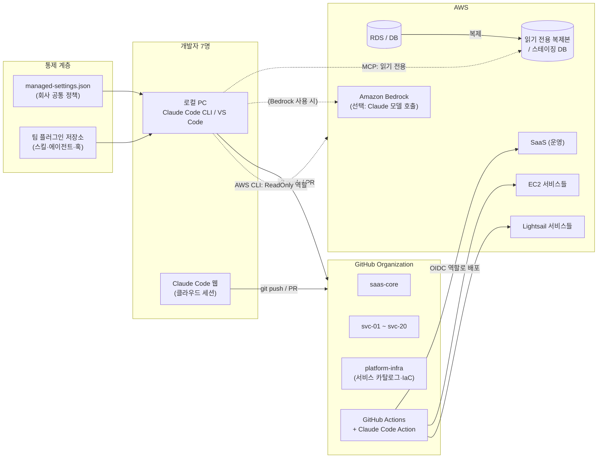
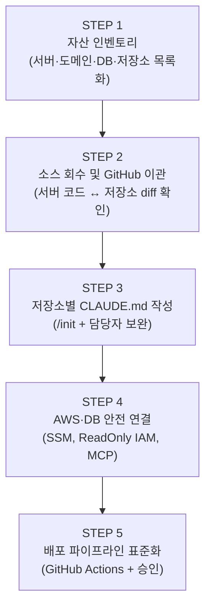
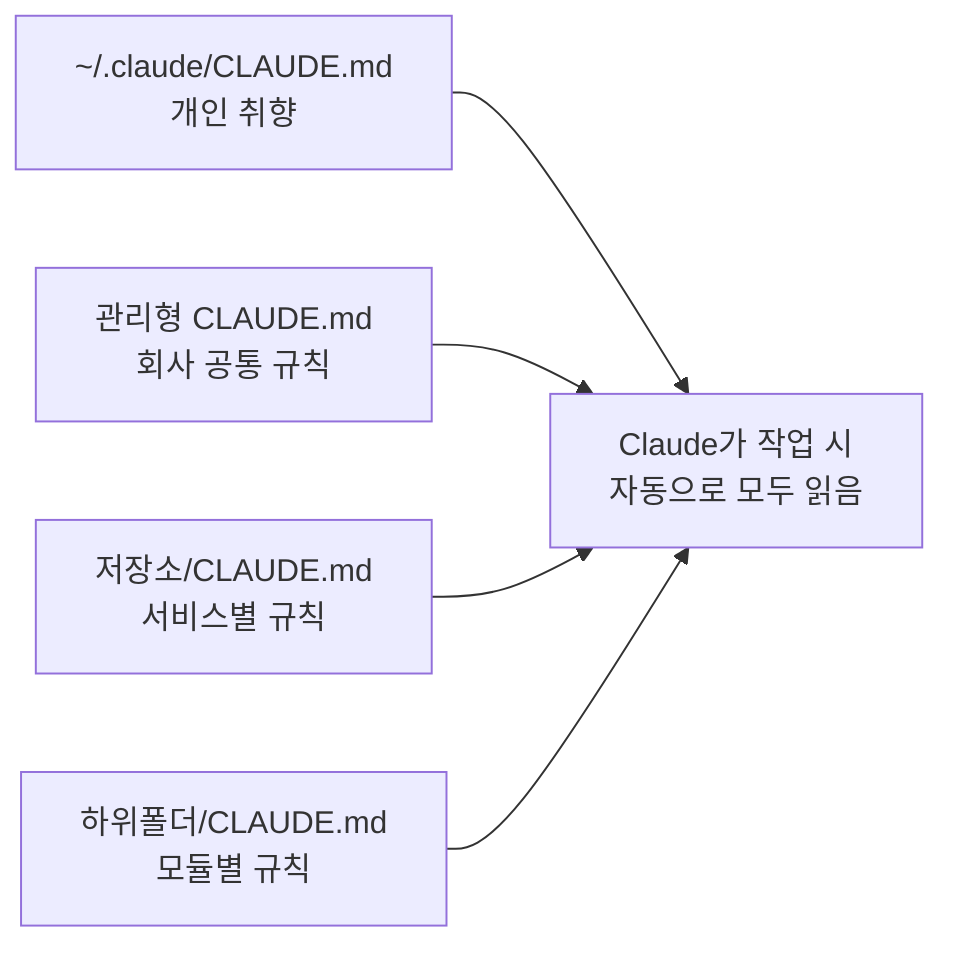
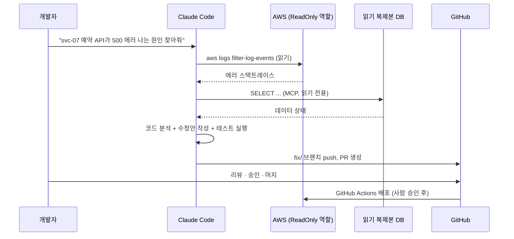
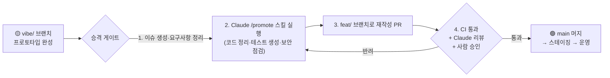
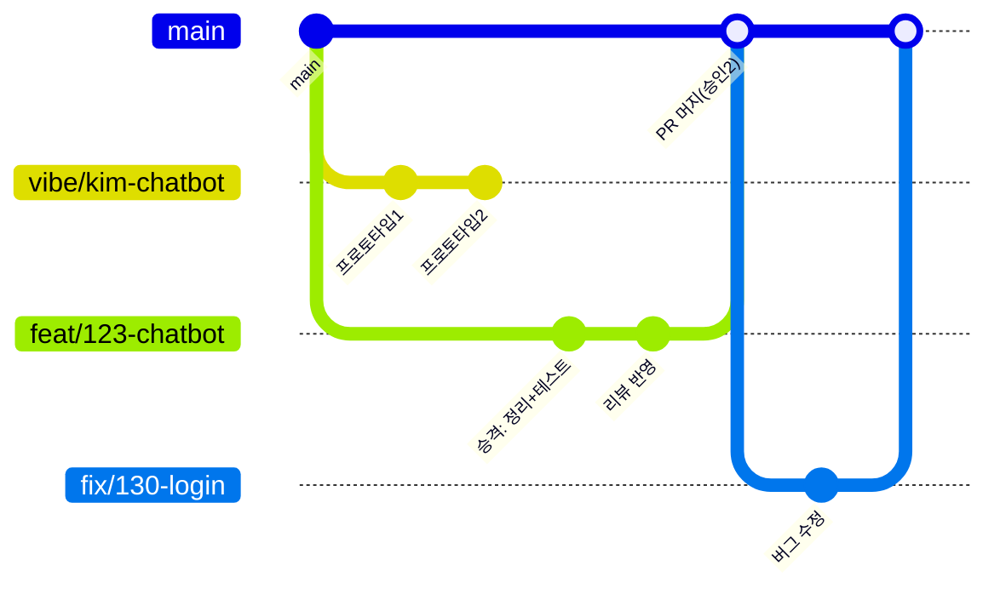
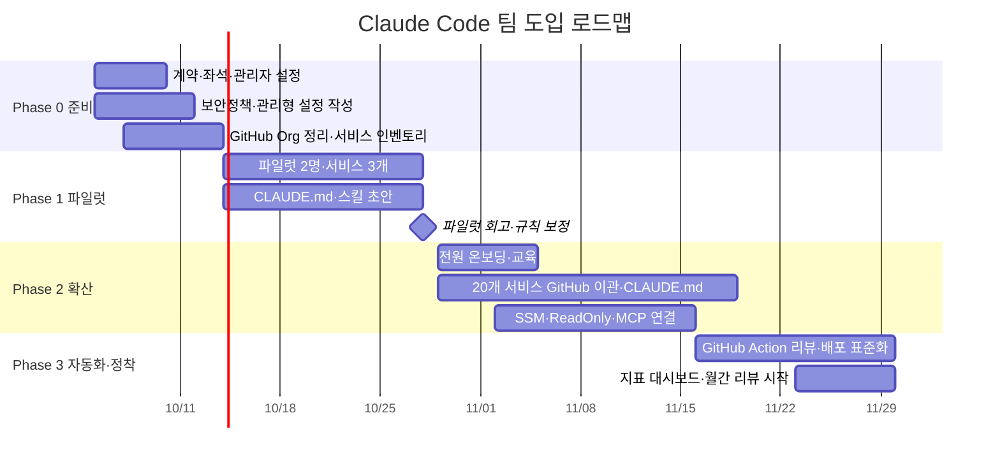
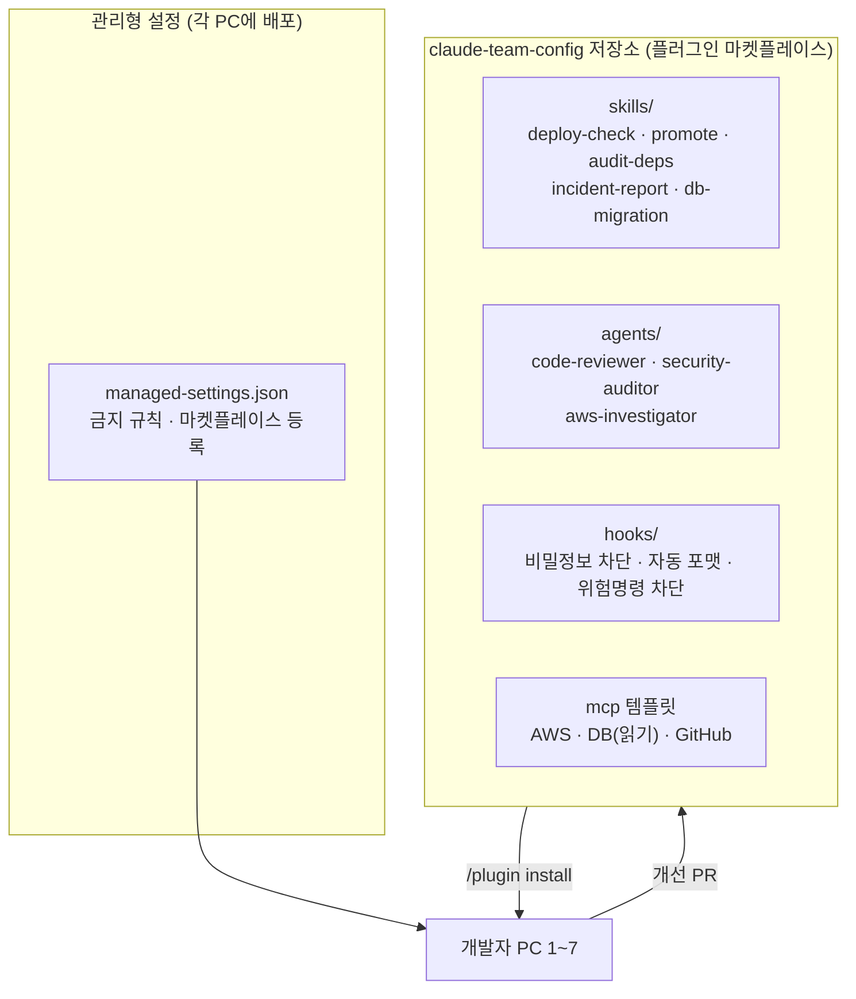

# Claude Code 기반 개발·운영 통합관리 제안서

> **대상 환경**: AWS 기반 · SaaS 서비스 1개 + EC2/Lightsail 개별 서비스 약 20개 · 개발자 7명
> **문서 구성**: ① 통합관리 방안 → ② 바이브/정식 코딩 병행 관리 방안 → ③ 팀 도입·운영 방안 → [부록] 세팅 절차서 (`02_부록_클로드코드_세팅_절차서.md`)

---

## 0. 한 장 요약

| 구분 | 현재 (As-Is) | 제안 (To-Be) | 핵심 도구 |
|---|---|---|---|
| 소스 관리 | 서버별·개발자별로 흩어짐 (서버에 직접 수정한 코드 존재 가능) | **GitHub Organization 1곳**에 서비스별 저장소 + 공통 설정 저장소 | GitHub, CODEOWNERS |
| 서비스 파악 | 담당자 머릿속, 문서 부재 | **서비스 카탈로그**(services.yaml) + 저장소마다 `CLAUDE.md` | Claude Code `/init` |
| 서버 접근 | SSH 키 공유, 개별 접속 | **SSM Session Manager** + 역할별 IAM (Claude는 읽기 전용) | AWS SSM, IAM |
| 배포 | 수동 (scp, git pull on server) | **GitHub Actions** 파이프라인 (사람 승인 후 배포) | GitHub Actions, OIDC |
| DB 접근 | 운영 DB 직접 접속 | **스테이징/읽기 전용 복제본**만 MCP로 연결 | MCP, RDS Read Replica |
| AI 활용 | 개인별 산발적 사용 | **팀 공통 규칙·권한·스킬**을 중앙 배포 | managed-settings, 플러그인 |
| 코딩 방식 | 구분 없음 | **바이브 트랙 / 정식 트랙** 분리 + 승격 게이트 | 브랜치 규칙, PR 템플릿 |
| 비용·품질 | 측정 불가 | **사용량·PR 리드타임·장애율** 대시보드 | OpenTelemetry, CloudWatch |



---

## 1. 개발 소스와 서비스 사이트를 Claude Code와 연결하여 통합관리하는 방법

### 1-1. 기본 원칙 — "Claude는 저장소를 통해 일하고, 서버는 파이프라인이 만진다"

| 원칙 | 설명 | 이유 |
|---|---|---|
| **Single Source of Truth** | 모든 코드는 GitHub에 있고, 서버의 코드는 항상 GitHub의 특정 커밋과 일치 | 서버에서 직접 고친 코드는 Claude도, 동료도 볼 수 없음 |
| **Context as Code** | 서비스 설명·규칙·명령어를 `CLAUDE.md`로 저장소에 커밋 | Claude가 20개 서비스를 매번 "처음 보는 코드"로 대하지 않도록 |
| **Read-only by default** | Claude가 AWS/DB에 접근할 때는 기본 읽기 전용 | 실수로 운영 데이터 변경·삭제 방지 |
| **Human-gated deploy** | 운영 배포는 사람이 승인한 GitHub Actions만 수행 | AI가 운영 서버에 직접 쓰기 권한을 갖지 않음 |
| **Central policy** | 권한/금지 규칙은 관리형 설정으로 전 PC에 동일 적용 | 7명이 각자 다른 보안 수준으로 쓰는 것 방지 |

### 1-2. 단계별 통합 절차 (5단계)



#### STEP 1. 자산 인벤토리 — "무엇이 어디서 돌고 있는가"

Claude Code로 AWS를 **읽기 전용**으로 조회해 초안을 만들고, 담당자가 보완합니다.

```bash
# 예: ReadOnly 프로파일로 Claude에게 인벤토리 초안 작성을 요청
claude "aws --profile readonly 로 ec2 describe-instances, lightsail get-instances,
rds describe-db-instances 결과를 조회해서 platform-infra/services.yaml 초안을 만들어줘"
```

**서비스 카탈로그 (`platform-infra/services.yaml`) 표준 항목**

| 필드 | 예시 | 비고 |
|---|---|---|
| `id` | `svc-07-reservation` | 저장소 이름과 동일 |
| `tier` | `1` / `2` / `3` | 1=매출·고객 직결(SaaS), 2=외부 공개 서비스, 3=내부/실험 |
| `host` | `ec2:i-0abc…` / `lightsail:web-07` | |
| `domain` | `reserve.example.com` | |
| `stack` | `node18 + express + mysql` | |
| `repo` | `github.com/org/svc-07-reservation` | |
| `owner` / `backup_owner` | `kim` / `lee` | 정·부 담당자 |
| `deploy` | `gha-ssm` / `gha-codedeploy` / `manual(이관예정)` | |
| `db` | `rds:prod-main / schema reserve` | |
| `status` | `active` / `legacy` / `sunset` | |

#### STEP 2. 소스 회수 및 GitHub 이관

| 상황 | 조치 |
|---|---|
| 저장소 있음, 서버와 일치 | 그대로 Organization으로 이전(Transfer) |
| 저장소 있음, **서버에서 직접 수정된 흔적** | 서버 코드를 `server-snapshot` 브랜치로 커밋 → Claude로 diff 분석·병합 |
| 저장소 없음 (서버에만 존재) | 서버에서 코드 회수 → 신규 저장소 생성 → `.gitignore`/비밀정보 제거 후 커밋 |
| 비밀정보(키·비밀번호)가 코드에 하드코딩 | **AWS Secrets Manager / SSM Parameter Store**로 이동, 저장소 이력에서도 제거 |

**저장소 구성 권장안 (Polyrepo + 공통 저장소)**

| 저장소 | 용도 | 비고 |
|---|---|---|
| `saas-core` | SaaS 본체 | Tier 1, 정식 트랙 전용 |
| `svc-01-xxx` ~ `svc-20-xxx` | 개별 서비스 | 서비스당 1개 |
| `platform-infra` | 서비스 카탈로그, IaC(Terraform), 공통 배포 워크플로 | DevOps 담당 |
| `claude-team-config` | 팀 공통 Claude 플러그인(스킬·에이전트·훅), 관리형 설정 원본 | AI 챔피언 담당 |
| `sandbox-vibe` | 바이브 코딩 실험장 | 운영 배포 불가 |

> 20개를 하나의 모노레포로 합치는 방안도 있지만, 스택이 서로 다른 레거시 서비스가 섞여 있으면 **폴리레포 + 공통 저장소**가 이관 비용과 위험이 가장 낮습니다.

#### STEP 3. 저장소별 `CLAUDE.md` 작성 — Claude의 "서비스 인수인계서"



| 계층 | 위치 | 내용 예시 | 관리자 |
|---|---|---|---|
| 회사 공통 | 관리형 경로 (부록 A-6) | 보안 규칙, 커밋 규칙, 금지 사항 | AI 챔피언 |
| 서비스별 | 각 저장소 루트 `CLAUDE.md` | 스택, 실행/테스트 명령, 배포 방식, DB 스키마 위치, 주의사항 | 서비스 담당자 |
| 모듈별 | `src/billing/CLAUDE.md` 등 | 결제 모듈 특수 규칙 | 모듈 담당자 |
| 개인 | `~/.claude/CLAUDE.md` | 응답 언어, 설명 스타일 | 본인 |

작성 방법: 각 저장소에서 `claude` 실행 → `/init` → 생성된 초안을 담당자가 검토·보완 → PR로 커밋. (템플릿은 부록 A-7)

#### STEP 4. AWS·DB 안전 연결

| 연결 대상 | 방식 | Claude 권한 | 비고 |
|---|---|---|---|
| EC2 서버 | **SSM Session Manager** (SSH 키 폐기) | 로그 조회·상태 확인 (명령 실행 시 매번 사람 승인) | 22번 포트 닫기 |
| Lightsail 서버 | SSM **하이브리드 활성화**로 관리형 노드 등록 | 동일 | Lightsail도 SSM으로 통합 관리 |
| AWS 리소스 | AWS CLI `--profile claude-readonly` | `ReadOnlyAccess` + 로그 조회 | 쓰기 명령은 설정에서 차단 |
| CloudWatch 로그 | AWS CLI / AWS MCP 서버 | 읽기 | 장애 분석에 가장 유용 |
| DB | **Postgres/MySQL MCP** → 스테이징 또는 읽기 복제본 | `SELECT` 전용 DB 계정 | 운영 원본 DB 연결 금지 |
| 비밀정보 | Secrets Manager | Claude 접근 불가 (deny 규칙) | `.env` 읽기 차단 |



#### STEP 5. 배포 파이프라인 표준화

| 서비스 유형 | 표준 배포 방식 | 설명 |
|---|---|---|
| SaaS (Tier 1) | GitHub Actions → 스테이징 자동 → **운영은 Environment 승인** | `production` 환경에 필수 승인자 2명 |
| EC2 서비스 | GitHub Actions → OIDC 역할 → `aws ssm send-command`로 배포 스크립트 실행 | SSH 키 불필요 |
| Lightsail 서비스 | 동일 (SSM 하이브리드 노드) 또는 Lightsail 컨테이너 서비스 | |
| 레거시(당장 이관 불가) | `platform-infra/runbooks/`에 수동 배포 절차 문서화 → 순차 이관 | |

추가로 **Claude Code GitHub Action**을 각 저장소에 설치하면 PR/이슈에서 `@claude`를 호출해 리뷰·수정·질의응답을 할 수 있습니다. (부록 A-10)

### 1-3. 통합관리 후 일상 활용 시나리오

| 시나리오 | 명령/행동 | 결과 |
|---|---|---|
| 장애 대응 | `claude "svc-12 최근 1시간 CloudWatch 에러 분석"` | 원인 요약 + 수정 PR |
| 20개 서비스 일괄 점검 | `/audit-deps` 스킬 (팀 공통) | 취약 라이브러리 목록 + 저장소별 이슈 생성 |
| 신규 입사자 온보딩 | `claude "이 서비스 구조 설명해줘"` | CLAUDE.md 기반 즉시 설명 |
| PR 리뷰 | PR에 `@claude review` 코멘트 | 자동 1차 리뷰 |
| 야간 정기 점검 | GitHub Actions 스케줄 + `claude -p` | 매일 아침 점검 리포트 이슈 |

---

## 2. 개발자 7명이 바이브 & 정식 코딩을 함께 관리하는 방안

### 2-1. 두 트랙 정의

| 항목 | 🟡 바이브 트랙 (Vibe) | 🟢 정식 트랙 (Formal) |
|---|---|---|
| 목적 | 아이디어 검증, 프로토타입, 내부 도구, 일회성 스크립트 | 운영 서비스 기능 개발, 버그 수정, 리팩터링 |
| 진행 방식 | 자연어로 빠르게 요청 → 결과 확인 → 반복 | **요구사항 → 계획(Plan 모드) → 구현 → 테스트 → 리뷰** |
| 브랜치 | `vibe/<이름>-<주제>` | `feat/`, `fix/`, `refactor/` + 이슈번호 |
| 저장소 | `sandbox-vibe` 또는 각 저장소의 `vibe/` 브랜치 | 서비스 저장소 |
| 배포 대상 | 개발/데모 환경만 | 스테이징 → 운영 |
| 테스트 | 선택 | **필수** (신규 코드 테스트 포함) |
| 리뷰 | 불필요 (공유 권장) | Claude 자동 리뷰 + **사람 1~2명 승인** |
| Claude 권한 모드 | `acceptEdits` (편집 자동 수락) | `default`/`plan` (변경마다 확인) |
| 허용 서비스 등급 | Tier 3 | Tier 1~3 전부 |

### 2-2. 서비스 등급(Tier)별 허용 범위

| 서비스 등급 | 해당 서비스 | 바이브 트랙 | 정식 트랙 | 필요 승인 |
|---|---|---|---|---|
| **Tier 1** | SaaS 본체 | ❌ (프로토타입은 sandbox에서만) | ✅ 필수 | 사람 2명 + CODEOWNER |
| **Tier 2** | 외부 고객이 쓰는 EC2/Lightsail 서비스 | ⚠️ 브랜치에서만, 머지 전 승격 필수 | ✅ | 사람 1명 |
| **Tier 3** | 내부 관리도구, 실험 서비스 | ✅ | ✅ | 사람 1명 (또는 자가 머지 허용) |

### 2-3. 바이브 → 정식 **승격 게이트**

바이브로 만든 결과물을 운영에 올리려면 아래 게이트를 반드시 통과합니다.



**승격 체크리스트 (PR 템플릿에 포함)**

- [ ] 연결된 이슈에 요구사항·수용 기준이 적혀 있다
- [ ] 하드코딩된 비밀정보·테스트용 계정이 없다
- [ ] 신규/변경 로직에 테스트가 있고 CI가 통과한다
- [ ] 입력 검증·권한 체크·SQL 인젝션 등 보안 점검(`/security-review`)을 했다
- [ ] DB 스키마 변경이 있으면 마이그레이션 스크립트와 롤백 방법이 있다
- [ ] 불필요한 파일·주석·디버그 코드를 제거했다
- [ ] 코드를 작성자가 **직접 설명할 수 있다** (AI가 짰어도 책임은 작성자)

### 2-4. 브랜치·PR·커밋 규칙



| 규칙 | 내용 | 강제 방법 |
|---|---|---|
| main 보호 | 직접 push 금지, PR 필수 | GitHub Branch protection / Rulesets |
| 필수 체크 | lint, test, build 통과 | Required status checks |
| 필수 승인 | Tier별 1~2명 | Required reviewers + CODEOWNERS |
| AI 표시 | Claude가 작성한 커밋은 `Co-Authored-By: Claude` 자동 기록 | Claude Code 기본 동작 (유지) |
| PR 라벨 | `track:vibe` / `track:formal`, `ai-assisted` | PR 템플릿 + 라벨 |
| PR 크기 | 변경 400줄 이하 권장 | Claude 리뷰에서 경고 |
| 비밀정보 | push 전 차단 | GitHub Secret scanning + Claude 훅 |

### 2-5. 정식 트랙 표준 작업 흐름 (Claude 활용)

| 단계 | 개발자 행동 | Claude Code 활용 | 산출물 |
|---|---|---|---|
| ① 요구사항 | 이슈 작성 | `@claude` 로 이슈 요구사항 구체화 | 이슈 (수용 기준 포함) |
| ② 계획 | `Shift+Tab`으로 **Plan 모드** 진입 | 영향 범위 분석, 구현 계획 제시 | 계획 (이슈 코멘트로 저장) |
| ③ 구현 | 계획 승인 | 코드 작성, 변경마다 확인 | 커밋 |
| ④ 테스트 | 테스트 실행 확인 | 테스트 작성·실행·수정 반복 | 테스트 코드 |
| ⑤ 자체 점검 | `/code-review`, `/security-review` | 버그·보안 1차 점검 | 수정 커밋 |
| ⑥ PR | PR 생성 | PR 설명 자동 작성 | PR |
| ⑦ 리뷰 | 동료 리뷰 | GitHub Action 자동 리뷰 | 승인 |
| ⑧ 배포 | 머지 → 승인 | — | 운영 반영 |

### 2-6. 7명 역할 배분 (RACI)

| 역할 | 인원 | 주요 책임 |
|---|---|---|
| **테크 리드** | 1 | 아키텍처·Tier 1 최종 승인, 규칙 최종 결정 |
| **AI 챔피언** | 1 (리드 겸임 가능) | Claude 설정·플러그인·CLAUDE.md 표준 관리, 사내 교육 |
| **DevOps/플랫폼** | 1 | AWS IAM·SSM·파이프라인, 비용 모니터링 |
| **SaaS 개발** | 2 | saas-core 정식 트랙 개발 |
| **서비스 개발** | 2 | 20개 서비스 분담(1인당 약 10개, 정·부 담당제) |

| 활동 | 테크리드 | AI챔피언 | DevOps | SaaS개발 | 서비스개발 |
|---|---|---|---|---|---|
| 팀 공통 Claude 정책 | A | R | C | I | I |
| 저장소 CLAUDE.md | C | C | I | R | R |
| AWS 권한·MCP 연결 | A | C | R | I | I |
| Tier 1 PR 승인 | A/R | C | C | R | I |
| 바이브 → 정식 승격 판단 | A | C | I | R | R |
| 배포 파이프라인 | C | I | A/R | C | C |
| 사용량·비용 리포트 | I | R | R | I | I |

> R=실행, A=최종책임, C=협의, I=공유

---

## 3. 팀이 함께 Claude Code를 도입·운영하는 방안

### 3-1. 도입 방식(요금/계약) 비교

> 가격·좌석 조건은 수시로 바뀌므로 계약 전 claude.com/pricing 및 AWS Bedrock 요금표에서 최신 정보를 확인하세요.

| 항목 | A. Claude **Team** 플랜 (Claude Code 포함 좌석) | B. Claude **Enterprise** | C. **Amazon Bedrock** (AWS 계정 과금) |
|---|---|---|---|
| 과금 | 좌석당 월정액 (사용 한도 내) | 계약 기반 | 토큰 사용량만큼 AWS 청구서에 합산 |
| 관리 콘솔 | claude.ai 관리자 화면 (멤버·좌석 관리) | + SSO, SCIM, 감사로그, 고급 정책 | AWS IAM·CloudTrail·Cost Explorer |
| 로그인 | 각자 claude.ai 계정 로그인 | SSO | AWS 자격증명 (IAM Identity Center) |
| 데이터 경로 | Anthropic | Anthropic | **AWS 리전 내** (기존 AWS 보안 정책 재사용) |
| Claude Code 웹/모바일, claude.ai 채팅 | ✅ | ✅ | ❌ (CLI·IDE·GitHub Action 중심) |
| 7명 팀 적합도 | ⭐⭐⭐ 가장 간단 | ⭐⭐ (규모 대비 과할 수 있음) | ⭐⭐⭐ AWS 중심 조직에 적합 |

**권장안: A + C 혼합**
- 개발자 7명 대화형 사용 → **Team 플랜 (Claude Code 포함 좌석)**: 도입이 가장 빠르고 비용 예측 가능
- CI/자동화(GitHub Actions의 Claude 리뷰, 야간 점검) → **Bedrock**: 이미 쓰는 AWS 청구·IAM으로 통제
- 사용량이 커지거나 SSO/감사 요건이 생기면 Enterprise 전환 검토

### 3-2. 도입 로드맵 (8주)



| 단계 | 기간 | 목표 | 완료 기준 (Exit Criteria) |
|---|---|---|---|
| Phase 0 준비 | 1~2주 | 계약·정책·저장소 정리 | 관리형 설정 배포 완료, 서비스 카탈로그 초안 |
| Phase 1 파일럿 | 2주 | 2명이 서비스 3개(SaaS 1 + 서비스 2)로 검증 | 공통 스킬 5개 이상, 규칙 v1 확정 |
| Phase 2 확산 | 3주 | 전원 사용, 20개 서비스 연결 | 전 저장소 CLAUDE.md, SSM 전환 완료 |
| Phase 3 정착 | 2주~ | 자동화·지표 운영 | PR 자동 리뷰 가동, 월간 리포트 1회 발행 |

### 3-3. 팀 공유 자산 구조 — "한 명이 만든 노하우를 7명이 쓴다"



| 공유 자산 | 위치 | 예시 | 효과 |
|---|---|---|---|
| **스킬 (Skills)** | `.claude/skills/<이름>/SKILL.md` | `/promote` 승격 점검, `/deploy-check` 배포 전 점검 | 반복 업무 표준화 |
| **서브에이전트** | `.claude/agents/*.md` | `security-auditor`, `aws-investigator` | 전문 역할 분리 |
| **훅 (Hooks)** | `settings.json`의 `hooks` | 파일 저장 후 자동 포맷, `rm -rf`·`DROP` 차단 | 실수 자동 방지 |
| **MCP 설정** | 저장소 `.mcp.json` | DB(읽기)·GitHub 연결 | 누구나 동일 환경 |
| **권한 규칙** | `.claude/settings.json` / 관리형 설정 | `.env` 읽기 금지, `terraform apply` 금지 | 보안 일관성 |

### 3-4. 보안·거버넌스 정책

| 영역 | 정책 | 구현 |
|---|---|---|
| 비밀정보 | Claude는 `.env`, `*.pem`, `secrets/` 읽기 불가 | 관리형 설정 `deny` 규칙 |
| 위험 명령 | `rm -rf`, `git push --force`, `terraform apply`, `aws * delete*` 차단 | `deny` 규칙 + PreToolUse 훅 |
| 권한 우회 | `--dangerously-skip-permissions` 사용 금지 | `disableBypassPermissionsMode: "disable"` |
| 운영 접근 | 운영 쓰기 권한은 Claude에 부여 안 함 | IAM 역할 분리 (ReadOnly만) |
| 개인정보 | 고객 개인정보가 담긴 운영 DB는 MCP 연결 금지 | 마스킹된 스테이징 DB만 연결 |
| 감사 | 누가 언제 무엇을 했는지 기록 | Git 이력(Co-Authored-By) + OpenTelemetry + CloudTrail |
| 외부 플러그인/MCP | 승인된 것만 사용 | 관리형 설정의 마켓플레이스·MCP 허용 목록 |

### 3-5. 운영 리듬 (정기 활동)

| 주기 | 활동 | 담당 | 산출물 |
|---|---|---|---|
| 매일 | 야간 자동 점검 리포트 확인 | 서비스 담당자 | 이슈 처리 |
| 매주 (30분) | **AI 활용 공유회**: 잘 된 프롬프트·실패 사례, 스킬 개선 제안 | AI 챔피언 | 스킬/CLAUDE.md 개선 PR |
| 격주 | CLAUDE.md 최신화 점검 (코드 변경 반영) | 서비스 담당자 | CLAUDE.md PR |
| 매월 | 사용량·비용·품질 지표 리뷰, 정책 조정 | 테크리드·DevOps | 월간 리포트 |
| 분기 | 권한·IAM·플러그인 감사, Tier 재분류 | DevOps·테크리드 | 감사 기록 |

### 3-6. 성과 지표 (KPI)

| 지표 | 측정 방법 | 목표 (3개월) |
|---|---|---|
| PR 리드타임 (생성→머지) | GitHub Insights | 30% 단축 |
| 장애 평균 복구 시간 (MTTR) | 장애 기록 | 30% 단축 |
| 운영 반영 후 롤백률 | 배포 기록 | 증가 없음 (품질 유지) |
| CLAUDE.md 보유 저장소 비율 | 저장소 점검 스크립트 | 100% |
| 서버 직접 수정 건수 | 서버 코드 ↔ Git diff 점검 | 0건 |
| 1인당 월 사용량·비용 | 관리자 콘솔 / OpenTelemetry / Cost Explorer | 예산 내 |
| 개발자 만족도 | 월간 설문 (5점) | 4.0 이상 |

### 3-7. 교육 계획

| 차수 | 대상 | 내용 | 시간 |
|---|---|---|---|
| 1차 | 전원 | 설치·로그인·기본 사용법, 권한 모드, 보안 규칙 | 2시간 |
| 2차 | 전원 | Plan 모드, CLAUDE.md 작성법, 바이브/정식 트랙 규칙 | 2시간 |
| 3차 | 전원 | 스킬·서브에이전트·MCP 사용, `@claude` GitHub 활용 | 2시간 |
| 심화 | AI 챔피언·DevOps | 훅·플러그인 제작, 관리형 설정, GitHub Actions/Bedrock | 4시간 |

---

## 부록

- **[부록] Claude Code 팀 세팅 상세 절차서** → [`02_부록_클로드코드_세팅_절차서.md`](./02_부록_클로드코드_세팅_절차서.md)
