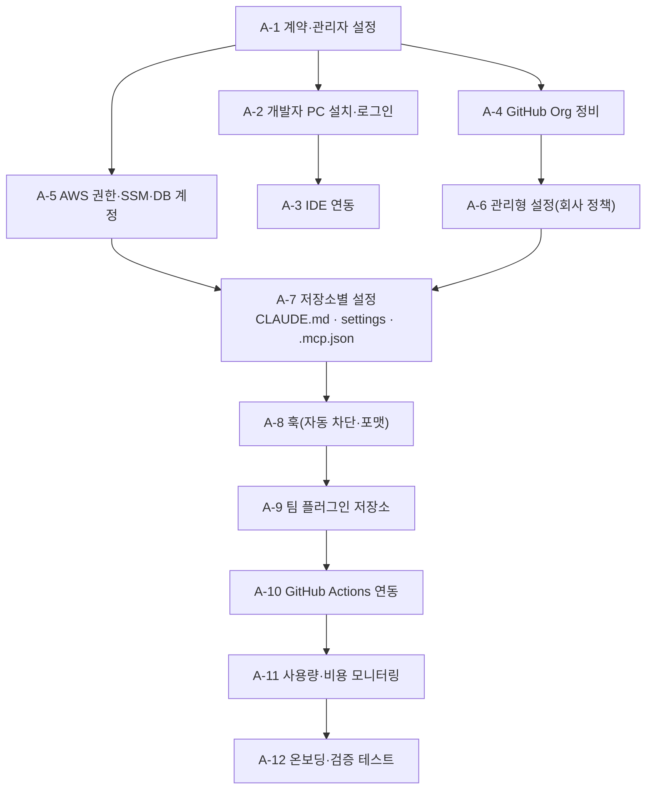
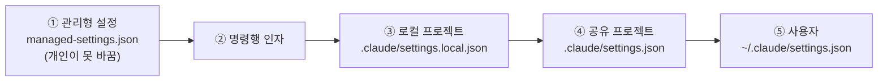
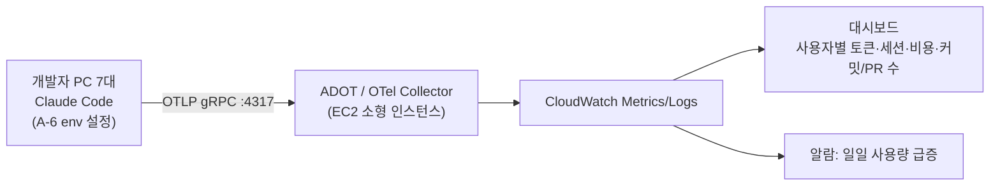

# [부록] Claude Code 팀 세팅 상세 절차서

> 본 절차서는 `01_통합관리_제안서.md`의 방안을 실제로 구축하기 위한 **단계별 작업 지침**입니다.
> 각 단계는 **담당 · 소요시간 · 선행조건 · 절차 · 완료 확인** 순서로 작성되었습니다.
> 표기: `org` = 회사 GitHub Organization 이름, `<...>` = 환경에 맞게 바꿀 값.
>
> ⚠️ Claude Code는 업데이트가 잦습니다. 설정 키·명령이 동작하지 않으면 `claude --version`으로 최신 버전인지 확인하고, 공식 문서(https://code.claude.com/docs)를 함께 참고하세요.

---

## A-0. 전체 작업 순서 한눈에 보기



| No | 작업 | 담당 | 소요 | 선행 |
|---|---|---|---|---|
| A-1 | 계약·관리자 설정 | 테크리드 | 0.5일 | — |
| A-2 | 개발자 PC 설치·로그인 | 개발자 각자 | 30분/인 | A-1 |
| A-3 | IDE 연동 | 개발자 각자 | 10분/인 | A-2 |
| A-4 | GitHub Organization 정비 | 테크리드·DevOps | 1~2일 | — |
| A-5 | AWS 권한·SSM·DB 읽기 계정 | DevOps | 2~3일 | — |
| A-6 | 관리형 설정(회사 공통 정책) 배포 | AI 챔피언 | 0.5일 | A-2 |
| A-7 | 저장소별 설정 파일 작성 | 서비스 담당자 | 1~2시간/저장소 | A-4, A-5 |
| A-8 | 훅 설정 | AI 챔피언 | 0.5일 | A-6 |
| A-9 | 팀 플러그인 저장소 구축 | AI 챔피언 | 1일 | A-8 |
| A-10 | GitHub Actions 연동 | DevOps | 1일 | A-4, A-5 |
| A-11 | 사용량·비용 모니터링 | DevOps | 0.5일 | A-6 |
| A-12 | 온보딩·검증 테스트 | AI 챔피언 | 1시간/인 | 전체 |

---

## A-1. 계약 및 관리자 설정

### A-1-1. Claude Team 플랜 (대화형 사용용, 권장)

| 순서 | 작업 | 화면/위치 |
|---|---|---|
| 1 | 테크리드가 회사 이메일로 claude.ai 가입 | https://claude.ai |
| 2 | **Team 플랜** 구매, 조직 이름 입력 | Settings → Billing |
| 3 | 좌석 7개 확보. 개발자 좌석은 **Claude Code가 포함된 좌석 유형**으로 지정 | Settings → Members / Seats |
| 4 | 개발자 7명 회사 이메일로 초대 | Settings → Members → Invite |
| 5 | 관리자 추가 지정 (테크리드 + AI 챔피언) | Members → Role: Admin |
| 6 | (가능한 경우) 관리자 콘솔의 Claude Code 관리 설정·사용량 화면 확인 | Admin settings → Claude Code |

**완료 확인**: 7명 모두 초대 수락, 좌석 유형이 Claude Code 사용 가능 상태.

### A-1-2. Amazon Bedrock (CI/자동화용, 선택)

| 순서 | 작업 | 위치 |
|---|---|---|
| 1 | Bedrock 콘솔에서 사용할 리전 선택 (Claude 모델 제공 리전인지 확인) | AWS Console → Amazon Bedrock |
| 2 | **Model access**에서 Anthropic Claude 모델 사용 신청·승인 | Bedrock → Model access |
| 3 | 사용할 모델의 **추론 프로파일 ID(Inference profile ID)** 기록 | Bedrock → Cross-region inference |
| 4 | Bedrock 호출용 IAM 정책 생성 (아래) | IAM → Policies |
| 5 | AWS Budgets에 Bedrock 월 예산·알림 설정 | Billing → Budgets |

```json
{
  "Version": "2012-10-17",
  "Statement": [
    {
      "Sid": "ClaudeCodeBedrock",
      "Effect": "Allow",
      "Action": [
        "bedrock:InvokeModel",
        "bedrock:InvokeModelWithResponseStream",
        "bedrock:ListInferenceProfiles",
        "bedrock:GetInferenceProfile"
      ],
      "Resource": [
        "arn:aws:bedrock:*:*:inference-profile/*",
        "arn:aws:bedrock:*:*:foundation-model/*"
      ]
    }
  ]
}
```

---

## A-2. 개발자 PC 설치 및 로그인

### A-2-1. 사전 요구사항

| 항목 | 요구 |
|---|---|
| OS | macOS, Linux(Ubuntu/Debian 등), Windows 10 이상(네이티브 또는 WSL2) |
| Git | 설치 필수 (`git --version`) |
| 네트워크 | `claude.ai`, `api.anthropic.com` 접근 가능 (사내 프록시 사용 시 `HTTPS_PROXY` 설정) |
| 기타 권장 | `jq`(훅 스크립트용), AWS CLI v2, GitHub CLI(`gh`) |

### A-2-2. 설치

```bash
# macOS / Linux / WSL — 네이티브 설치(권장)
curl -fsSL https://claude.ai/install.sh | bash

# macOS — Homebrew
brew install --cask claude-code

# (대안) Node.js 18+ 환경에서 npm 설치
npm install -g @anthropic-ai/claude-code
```

```powershell
# Windows PowerShell
irm https://claude.ai/install.ps1 | iex
```

### A-2-3. 설치 확인 및 로그인

```bash
claude --version      # 버전 확인
claude doctor         # 설치 상태 진단
cd ~/work/saas-core   # 아무 저장소로 이동
claude                # 첫 실행 → 브라우저가 열리면 회사 Team 계정으로 로그인
```

- 로그인 화면에서 **Claude 계정(구독)** 을 선택하고 회사 Team 조직으로 로그인합니다.
- 로그인 후 `/status` 로 로그인 계정과 조직이 맞는지 확인합니다.

### A-2-4. (선택) Bedrock으로 사용하는 경우

`~/.claude/settings.json` 또는 셸 프로파일에 설정합니다.

```json
{
  "env": {
    "CLAUDE_CODE_USE_BEDROCK": "1",
    "AWS_REGION": "<bedrock-리전 예: us-east-1>",
    "AWS_PROFILE": "claude-bedrock",
    "ANTHROPIC_MODEL": "<A-1-2에서 기록한 추론 프로파일 ID>"
  }
}
```

```bash
aws sso login --profile claude-bedrock   # IAM Identity Center 로그인
claude                                   # Bedrock 경유로 동작
```

**완료 확인**: `claude` 실행 후 `이 저장소 구조를 한 문단으로 설명해줘` 에 정상 응답.

---

## A-3. IDE 연동

| IDE | 설치 방법 | 사용 |
|---|---|---|
| VS Code / Cursor | 확장(Extensions)에서 **"Claude Code"** (Anthropic) 설치 | 사이드바 Claude 아이콘, 편집기에서 변경사항 diff 확인 |
| JetBrains (IntelliJ, PyCharm, WebStorm 등) | Plugins 마켓플레이스에서 **"Claude Code"** 설치 후 IDE 재시작 | IDE 내장 터미널에서 `claude` 실행 시 자동 연결 |
| 터미널 사용 시 연결 | 외부 터미널에서 `claude` 실행 후 `/ide` | 열린 IDE와 연결 |

**완료 확인**: Claude가 파일을 수정할 때 IDE에 diff 창이 표시됨.

---

## A-4. GitHub Organization 정비

### A-4-1. 조직·팀 구성

| 순서 | 작업 | 위치 |
|---|---|---|
| 1 | Organization 생성(또는 기존 사용), 2FA 필수화 | Org Settings → Authentication security |
| 2 | 팀 생성: `leads`, `saas-dev`, `svc-dev`, `devops` | Org → Teams |
| 3 | 저장소 생성/이전: `saas-core`, `svc-01-*`~`svc-20-*`, `platform-infra`, `claude-team-config`, `sandbox-vibe` | Org → Repositories |
| 4 | 기본 권한: Members = Read, 팀별 Write 부여 | Org Settings → Member privileges |
| 5 | Secret scanning + Push protection 활성화 | Org Settings → Code security |

### A-4-2. 서버에만 있는 코드 회수 (저장소가 없는 서비스)

```bash
# 1) 서버에서 코드 압축 (SSM 세션 또는 기존 SSH)
sudo tar --exclude='node_modules' --exclude='vendor' --exclude='*.log' \
     -czf /tmp/svc-07.tgz -C /var/www svc-07

# 2) 로컬로 가져와 저장소 초기화
mkdir svc-07-reservation && cd svc-07-reservation
tar -xzf ~/Downloads/svc-07.tgz --strip-components=1
git init -b main

# 3) 비밀정보 점검을 Claude에게 먼저 맡김 (커밋 전!)
claude "이 폴더에서 하드코딩된 비밀번호·API키·DB접속정보를 찾아 목록으로 보여주고,
환경변수로 바꾸는 수정안과 .gitignore를 만들어줘. 아직 커밋하지 마."

# 4) 검토 후 커밋·푸시
git add . && git commit -m "chore: import svc-07 from production server"
git remote add origin git@github.com:org/svc-07-reservation.git
git push -u origin main
```

### A-4-3. 서버 코드와 저장소가 다른 경우 (직접 수정 흔적)

```bash
git checkout -b server-snapshot
# 서버 코드로 작업 폴더 덮어쓰기 후
git add -A && git commit -m "chore: snapshot of production server code"
claude "main 과 server-snapshot 브랜치의 차이를 분석해서, 서버에서 직접 수정된
변경사항을 기능 단위로 정리하고 main 에 반영할 것/버릴 것을 제안해줘"
```

### A-4-4. 브랜치 보호 (Ruleset)

Org Settings → Rules → Rulesets → **New branch ruleset** (대상: 모든 저장소의 `main`)

| 규칙 | 설정값 |
|---|---|
| Restrict deletions | ✅ |
| Block force pushes | ✅ |
| Require a pull request before merging | ✅ / Required approvals: Tier1=2, 그 외=1 |
| Require review from Code Owners | ✅ (Tier 1, 2) |
| Dismiss stale approvals on new commits | ✅ |
| Require status checks to pass | ✅ `lint`, `test`, `build` |
| Bypass list | 테크리드만 (긴급 시) |

### A-4-5. CODEOWNERS (`.github/CODEOWNERS`)

```text
# 기본 담당
*                       @org/saas-dev
# 결제·인증 등 민감 영역은 리드 필수 리뷰
/src/billing/           @org/leads
/src/auth/              @org/leads
# Claude/CI 설정 변경은 AI 챔피언·DevOps 리뷰
/.claude/               @org/leads
/.mcp.json              @org/devops
/.github/workflows/     @org/devops
/CLAUDE.md              @org/leads
```

### A-4-6. PR 템플릿 (`.github/pull_request_template.md`)

```markdown
## 변경 요약
<!-- 무엇을, 왜 -->

## 관련 이슈
Closes #

## 트랙
- [ ] 🟡 vibe (Tier 3 / 데모 환경 전용)
- [ ] 🟢 formal

## 승격 체크리스트 (formal 필수)
- [ ] 요구사항·수용 기준이 이슈에 있다
- [ ] 하드코딩된 비밀정보·테스트 계정이 없다
- [ ] 테스트 추가 및 CI 통과
- [ ] /security-review 실행 결과 확인
- [ ] DB 변경 시 마이그레이션·롤백 절차 첨부
- [ ] 디버그 코드·불필요 파일 제거
- [ ] 작성자가 전체 코드를 설명할 수 있다

## 테스트 방법
```

### A-4-7. 라벨

| 라벨 | 색 | 용도 |
|---|---|---|
| `track:vibe` | 노랑 | 바이브 트랙 |
| `track:formal` | 초록 | 정식 트랙 |
| `ai-assisted` | 보라 | Claude가 상당 부분 작성 |
| `tier:1` / `tier:2` / `tier:3` | 빨강/주황/회색 | 서비스 등급 |
| `claude-review` | 파랑 | 자동 리뷰 요청 |

**완료 확인**: 테스트 저장소에서 main 직접 push 시 거부, PR에 템플릿 자동 표시.

---

## A-5. AWS 권한 · SSM · DB 읽기 계정

### A-5-1. IAM Identity Center 권한 세트

| 권한 세트 | 대상 | 정책 | 용도 |
|---|---|---|---|
| `Dev-ClaudeReadOnly` | 개발자 7명 | `ReadOnlyAccess` + `CloudWatchLogsReadOnlyAccess` + 아래 Deny 정책 | Claude가 AWS 조회 시 사용 |
| `Dev-Operator` | DevOps, 리드 | 서비스별 운영 권한 | 사람의 수동 운영 |
| `GitHubActions-Deploy` | (OIDC 역할) | 배포 대상 한정 권한 | CI 배포 전용 |

`ReadOnlyAccess`에도 S3 객체·Secrets 조회 등 민감한 읽기가 포함되므로 명시적 Deny를 추가합니다.

```json
{
  "Version": "2012-10-17",
  "Statement": [
    {
      "Sid": "DenySensitiveReads",
      "Effect": "Deny",
      "Action": [
        "secretsmanager:GetSecretValue",
        "ssm:GetParameter*",
        "kms:Decrypt",
        "s3:GetObject",
        "rds:DownloadDBLogFilePortion",
        "lightsail:GetInstanceAccessDetails",
        "lightsail:DownloadDefaultKeyPair"
      ],
      "Resource": "*"
    }
  ]
}
```

개발자 PC `~/.aws/config`:

```ini
[profile claude-readonly]
sso_session = company
sso_account_id = <계정ID>
sso_role_name = Dev-ClaudeReadOnly
region = ap-northeast-2

[sso-session company]
sso_start_url = https://<company>.awsapps.com/start
sso_region = ap-northeast-2
sso_registration_scopes = sso:account:access
```

```bash
aws sso login --profile claude-readonly
aws sts get-caller-identity --profile claude-readonly   # 역할 확인
```

### A-5-2. EC2 → SSM Session Manager 전환

| 순서 | 작업 |
|---|---|
| 1 | 인스턴스 역할에 `AmazonSSMManagedInstanceCore` 정책 부착 (역할이 없으면 생성 후 연결) |
| 2 | SSM Agent 설치 확인 (Amazon Linux 2/2023, Ubuntu 공식 AMI는 기본 설치) |
| 3 | Systems Manager → Fleet Manager 에서 "Online" 확인 |
| 4 | 접속 테스트: `aws ssm start-session --target i-0abc... --profile <운영자프로파일>` |
| 5 | 보안그룹에서 22번 포트 인바운드 제거 |

### A-5-3. Lightsail → SSM 하이브리드 관리형 노드 등록

```bash
# (1) DevOps PC: 서비스 역할 생성 (최초 1회)
aws iam create-role --role-name SSMServiceRole \
  --assume-role-policy-document '{"Version":"2012-10-17","Statement":[{"Effect":"Allow","Principal":{"Service":"ssm.amazonaws.com"},"Action":"sts:AssumeRole"}]}'
aws iam attach-role-policy --role-name SSMServiceRole \
  --policy-arn arn:aws:iam::aws:policy/AmazonSSMManagedInstanceCore

# (2) 활성화 코드 발급 (Lightsail 대수만큼)
aws ssm create-activation \
  --default-instance-name lightsail \
  --iam-role SSMServiceRole \
  --registration-limit 20 \
  --region ap-northeast-2
# → ActivationId, ActivationCode 기록

# (3) 각 Lightsail 인스턴스 (Ubuntu 예시)
sudo snap install amazon-ssm-agent --classic    # 미설치 시
sudo systemctl stop snap.amazon-ssm-agent.amazon-ssm-agent.service
sudo /snap/amazon-ssm-agent/current/amazon-ssm-agent \
  -register -code "<ActivationCode>" -id "<ActivationId>" -region "ap-northeast-2"
sudo systemctl start snap.amazon-ssm-agent.amazon-ssm-agent.service
```

> 비 EC2(하이브리드) 노드에서 **Session Manager 접속**을 쓰려면 Systems Manager의 **고급 인스턴스 티어(Advanced-instances tier)** 가 필요합니다(유료). 비용이 부담되면 Run Command(배포)만 SSM으로 쓰고 접속은 기존 방식을 유지하는 것도 가능합니다.

### A-5-4. DB 읽기 전용 계정 (스테이징 또는 읽기 복제본에 생성)

**MySQL / MariaDB**
```sql
CREATE USER 'claude_ro'@'%' IDENTIFIED BY '<강력한_비밀번호>';
GRANT SELECT, SHOW VIEW ON reserve.* TO 'claude_ro'@'%';
-- 개인정보 테이블은 제외하려면 테이블 단위로 GRANT
FLUSH PRIVILEGES;
```

**PostgreSQL**
```sql
CREATE ROLE claude_ro LOGIN PASSWORD '<강력한_비밀번호>';
GRANT CONNECT ON DATABASE app TO claude_ro;
GRANT USAGE ON SCHEMA public TO claude_ro;
GRANT SELECT ON ALL TABLES IN SCHEMA public TO claude_ro;
ALTER DEFAULT PRIVILEGES IN SCHEMA public GRANT SELECT ON TABLES TO claude_ro;
ALTER ROLE claude_ro SET default_transaction_read_only = on;
ALTER ROLE claude_ro SET statement_timeout = '15s';
```

- 접속 문자열은 각자 PC의 환경변수(`DB_RO_URL_SVC07` 등)로만 보관하고 **저장소에 커밋하지 않습니다.**
- DB는 퍼블릭 공개 대신 SSM 포트포워딩으로 접근합니다.

```bash
aws ssm start-session --target <점프호스트 인스턴스ID> \
  --document-name AWS-StartPortForwardingSessionToRemoteHost \
  --parameters '{"host":["<replica-endpoint>"],"portNumber":["3306"],"localPortNumber":["13306"]}'
```

**완료 확인**: `claude_ro`로 `INSERT` 시도 시 권한 오류, `aws s3 cp s3://.../x -`(readonly 프로파일) 시 AccessDenied.

---

## A-6. 관리형 설정 (회사 공통 정책) 배포

### A-6-1. 설정 우선순위



> 번호가 작을수록 우선. 관리형 설정의 `deny`는 누구도 해제할 수 없습니다.

### A-6-2. 파일 위치

| OS | 관리형 설정 | 관리형 CLAUDE.md (회사 공통 지침) |
|---|---|---|
| macOS | `/Library/Application Support/ClaudeCode/managed-settings.json` | `/Library/Application Support/ClaudeCode/CLAUDE.md` |
| Linux / WSL | `/etc/claude-code/managed-settings.json` | `/etc/claude-code/CLAUDE.md` |
| Windows | `C:\Program Files\ClaudeCode\managed-settings.json` | `C:\Program Files\ClaudeCode\CLAUDE.md` |

### A-6-3. `managed-settings.json` (원본은 `claude-team-config/managed/`에 보관)

```json
{
  "permissions": {
    "defaultMode": "default",
    "disableBypassPermissionsMode": "disable",
    "deny": [
      "Read(**/.env)",
      "Read(**/.env.*)",
      "Read(**/*.pem)",
      "Read(**/*.key)",
      "Read(**/secrets/**)",
      "Read(~/.aws/credentials)",
      "Read(~/.ssh/**)",
      "Bash(rm -rf:*)",
      "Bash(sudo:*)",
      "Bash(git push --force:*)",
      "Bash(git push -f:*)",
      "Bash(terraform apply:*)",
      "Bash(terraform destroy:*)",
      "Bash(aws secretsmanager get-secret-value:*)"
    ],
    "ask": [
      "Bash(git push:*)",
      "Bash(aws ssm send-command:*)",
      "Bash(aws ssm start-session:*)",
      "Bash(docker:*)"
    ]
  },
  "enableAllProjectMcpServers": false,
  "env": {
    "CLAUDE_CODE_ENABLE_TELEMETRY": "1",
    "OTEL_METRICS_EXPORTER": "otlp",
    "OTEL_LOGS_EXPORTER": "otlp",
    "OTEL_EXPORTER_OTLP_PROTOCOL": "grpc",
    "OTEL_EXPORTER_OTLP_ENDPOINT": "http://<otel-collector-host>:4317"
  },
  "extraKnownMarketplaces": {
    "team-tools": {
      "source": { "source": "github", "repo": "org/claude-team-config" }
    }
  },
  "enabledPlugins": {
    "team-core@team-tools": true
  },
  "cleanupPeriodDays": 30
}
```

| 키 | 의미 |
|---|---|
| `deny` | 절대 금지 (비밀정보 읽기, 파괴적 명령) |
| `ask` | 실행 전 매번 사람 확인 |
| `disableBypassPermissionsMode` | 권한 확인 전체 생략 모드(`--dangerously-skip-permissions`) 사용 불가 |
| `enableAllProjectMcpServers: false` | 저장소의 `.mcp.json` 서버를 자동 승인하지 않고 개인이 확인 후 승인 |
| `env` | 사용량 텔레메트리 수집 (A-11) |
| `extraKnownMarketplaces` / `enabledPlugins` | 팀 플러그인 자동 등록·활성화 (A-9) |

> `deny` 규칙은 **보조 방어선**입니다. 명령어 패턴은 우회 여지가 있으므로 실제 차단은 **IAM 권한(A-5)** 과 **훅(A-8)** 으로 이중화합니다.

### A-6-4. 관리형 `CLAUDE.md` (회사 공통 지침)

```markdown
# 회사 공통 개발 지침 (모든 저장소에 적용)

## 언어
- 설명과 커밋 메시지 본문은 한국어, 코드·식별자는 영어.

## 절대 규칙
- 운영(production) 서버·DB에 직접 쓰기 작업을 하지 않는다. 배포는 GitHub Actions로만.
- 비밀정보(.env, 키, 비밀번호)를 읽거나 출력하거나 코드에 하드코딩하지 않는다.
- main 브랜치에 직접 커밋하지 않는다. 작업은 항상 브랜치에서 한다.
- DB 스키마 변경은 마이그레이션 파일로만, 롤백 스크립트를 함께 작성한다.

## 브랜치 규칙
- 정식: feat/<이슈번호>-<요약>, fix/<이슈번호>-<요약>, refactor/...
- 바이브: vibe/<이름>-<주제> (운영 배포 금지)

## 커밋 규칙
- Conventional Commits: feat:, fix:, refactor:, test:, docs:, chore:
- 하나의 커밋은 하나의 논리적 변경.

## 작업 방식
- 3개 이상 파일을 바꾸는 작업은 먼저 계획을 제시하고 승인받는다.
- 코드 변경 후 해당 저장소의 테스트 명령을 실행해 결과를 보고한다.
- 모르는 서비스 구조는 추측하지 말고 CLAUDE.md, README, 코드를 먼저 읽는다.
```

### A-6-5. 배포 방법

| 방법 | 대상 | 절차 |
|---|---|---|
| MDM (Jamf, Intune 등) | 회사 관리 PC | 위 두 파일을 해당 경로에 배포하는 프로파일/스크립트 등록 |
| 설치 스크립트 | MDM 미사용 시 | 아래 스크립트를 온보딩 시 1회 실행 (관리자 권한) |
| 관리자 콘솔 원격 배포 | Team/Enterprise | 플랜에서 서버 관리형 설정을 지원하는 경우 콘솔에서 JSON 등록 |

```bash
#!/usr/bin/env bash
# install-managed-settings.sh  (claude-team-config/managed/ 에 보관)
set -euo pipefail
SRC="$(cd "$(dirname "$0")" && pwd)"
case "$(uname -s)" in
  Darwin) DEST="/Library/Application Support/ClaudeCode" ;;
  Linux)  DEST="/etc/claude-code" ;;
  *) echo "Windows는 PowerShell 스크립트 사용"; exit 1 ;;
esac
sudo mkdir -p "$DEST"
sudo cp "$SRC/managed-settings.json" "$DEST/managed-settings.json"
sudo cp "$SRC/CLAUDE.md"             "$DEST/CLAUDE.md"
sudo chmod 644 "$DEST/managed-settings.json" "$DEST/CLAUDE.md"
echo "관리형 설정 설치 완료: $DEST"
```

**완료 확인**: Claude 실행 후 `/permissions` 에서 관리형(Managed) 규칙이 보이고, `cat .env` 요청 시 거부됨.

---

## A-7. 저장소별 설정 파일

각 서비스 저장소에 아래 구조를 만듭니다.

```text
svc-07-reservation/
├── CLAUDE.md                  # 서비스 인수인계서 (커밋)
├── .mcp.json                  # 팀 공용 MCP 서버 (커밋, 비밀정보는 환경변수)
├── .claude/
│   ├── settings.json          # 팀 공용 권한·훅 (커밋)
│   ├── settings.local.json    # 개인용 (커밋 안 함, 자동 gitignore)
│   ├── skills/                # 이 저장소 전용 스킬 (선택)
│   └── agents/                # 이 저장소 전용 서브에이전트 (선택)
└── .github/
    ├── CODEOWNERS
    ├── pull_request_template.md
    └── workflows/claude.yml   # A-10
```

### A-7-1. `CLAUDE.md` 작성 절차

```bash
cd svc-07-reservation
claude
> /init        # Claude가 코드를 분석해 CLAUDE.md 초안 생성
```

생성된 초안을 아래 템플릿 항목에 맞춰 담당자가 보완합니다.

```markdown
# svc-07-reservation

## 개요
- 역할: 고객 예약 접수·조회 API + 관리자 웹
- 등급: Tier 2 (외부 고객 사용)
- 담당: @kim (정), @lee (부)
- 도메인: https://reserve.example.com
- 호스트: Lightsail `web-07` (ap-northeast-2), SSM 노드 ID mi-0123...

## 기술 스택
- Node.js 18, Express 4, MySQL 8 (RDS prod-main / schema `reserve`)
- 프론트: EJS 템플릿 + jQuery (레거시)

## 명령어
- 설치: `npm ci`
- 로컬 실행: `npm run dev` (포트 3000, `.env.example` 참고)
- 테스트: `npm test`
- 린트: `npm run lint`

## 구조
- `src/routes/` API 라우트, `src/services/` 비즈니스 로직, `src/db/` 쿼리
- `migrations/` DB 마이그레이션 (knex)

## 배포
- main 머지 → GitHub Actions `deploy.yml` → SSM Run Command로 `/opt/deploy/svc07.sh` 실행
- 운영 로그: CloudWatch Logs `/svc07/app`

## 주의사항
- `src/services/payment.js` 는 외부 PG 연동. 변경 시 반드시 리드 리뷰.
- 예약 시간은 모두 KST 저장(레거시). UTC로 바꾸지 말 것.
- 조회 쿼리는 `reservations.created_at` 인덱스를 타도록 작성.

## 조회용 연결 (읽기 전용)
- AWS: `--profile claude-readonly`
- DB: MCP `reserve-db-ro` (스테이징 복제본)
```

### A-7-2. `.claude/settings.json` (팀 공용)

```json
{
  "permissions": {
    "allow": [
      "Bash(npm ci)",
      "Bash(npm test:*)",
      "Bash(npm run lint:*)",
      "Bash(npm run build:*)",
      "Bash(git status)",
      "Bash(git diff:*)",
      "Bash(git log:*)",
      "Bash(aws logs filter-log-events --profile claude-readonly:*)",
      "Bash(aws logs tail --profile claude-readonly:*)",
      "mcp__reserve-db-ro__query"
    ]
  },
  "enabledMcpjsonServers": ["reserve-db-ro", "aws-readonly"]
}
```

> `allow`는 "확인 없이 실행해도 되는 안전한 명령"만 등록합니다. 권한 확인 팝업이 너무 잦으면 `/permissions` 로 추가하거나 `/fewer-permission-prompts` 스킬을 활용해 자주 쓰는 읽기 명령을 정리합니다.

### A-7-3. `.mcp.json` (팀 공용 MCP 서버)

```json
{
  "mcpServers": {
    "reserve-db-ro": {
      "command": "npx",
      "args": ["-y", "@modelcontextprotocol/server-postgres", "${DB_RO_URL_SVC07}"]
    },
    "aws-readonly": {
      "command": "uvx",
      "args": ["awslabs.aws-api-mcp-server@latest"],
      "env": {
        "AWS_PROFILE": "claude-readonly",
        "AWS_REGION": "ap-northeast-2",
        "READ_OPERATIONS_ONLY": "true"
      }
    }
  }
}
```

- `${DB_RO_URL_SVC07}` 처럼 **환경변수 참조**를 사용해 접속정보를 커밋하지 않습니다.
- DB 종류(MySQL 등)에 맞는 MCP 서버는 AI 챔피언이 **보안 검토 후 승인 목록**으로 관리합니다. 예시의 서버 패키지는 참고용이며, 사내 표준으로 정한 서버로 교체하세요.
- CLI로 추가할 수도 있습니다:

```bash
claude mcp add --scope project aws-readonly \
  --env AWS_PROFILE=claude-readonly --env READ_OPERATIONS_ONLY=true \
  -- uvx awslabs.aws-api-mcp-server@latest
claude mcp list        # 등록 확인
```

Claude 실행 후 `/mcp` 로 연결 상태를 확인합니다. 처음 실행하면 저장소 MCP 서버 승인 여부를 묻습니다.

**완료 확인**: `svc-07 스테이징 DB에서 최근 7일 예약 건수를 날짜별로 보여줘` 요청에 MCP로 정상 응답.

---

## A-8. 훅 (자동 차단 · 자동 포맷)

훅은 Claude의 도구 실행 전후에 **셸 스크립트를 자동 실행**합니다. `PreToolUse` 훅이 종료코드 `2`로 끝나면 해당 명령은 차단되고, 표준에러 메시지가 Claude에게 전달됩니다.

| 이벤트 | 용도 |
|---|---|
| `PreToolUse` | 위험 명령 차단, 운영 대상 명령 차단 |
| `PostToolUse` | 파일 수정 후 자동 포맷/린트 |
| `UserPromptSubmit` | 프롬프트에 비밀정보 포함 시 경고 |
| `SessionStart` | 세션 시작 시 브랜치·환경 안내 출력 |
| `Stop` | 작업 종료 시 테스트 실행 알림 등 |

### A-8-1. 위험 명령 차단 스크립트 (`hooks/block-dangerous.sh`)

```bash
#!/usr/bin/env bash
# PreToolUse(Bash) — 위험한 명령을 차단한다.
input="$(cat)"
cmd="$(echo "$input" | jq -r '.tool_input.command // ""')"

patterns=(
  'rm -rf /'
  'rm -rf \*'
  'DROP (TABLE|DATABASE)'
  'TRUNCATE '
  'DELETE FROM [a-zA-Z_]+ *;'
  'aws .* (delete|terminate|remove)-'
  'lightsail (delete|stop)-instance'
  '--profile +(prod|production|admin)'
  'git push .*(--force|-f)( |$)'
  'git push .* main( |$)'
)
for p in "${patterns[@]}"; do
  if echo "$cmd" | grep -Eiq -- "$p"; then
    echo "🚫 팀 정책으로 차단된 명령입니다: [$p] — 운영 변경은 GitHub Actions 배포 절차를 이용하세요." >&2
    exit 2
  fi
done
exit 0
```

### A-8-2. 자동 포맷 스크립트 (`hooks/auto-format.sh`)

```bash
#!/usr/bin/env bash
# PostToolUse(Edit|Write) — 수정된 파일을 포맷한다.
file="$(jq -r '.tool_input.file_path // ""')"
[ -z "$file" ] && exit 0
case "$file" in
  *.js|*.ts|*.jsx|*.tsx|*.json|*.css|*.html) npx --no-install prettier --write "$file" >/dev/null 2>&1 ;;
  *.py) ruff format "$file" >/dev/null 2>&1 ;;
  *.php) vendor/bin/php-cs-fixer fix "$file" >/dev/null 2>&1 ;;
esac
exit 0
```

### A-8-3. 훅 등록 (저장소 `.claude/settings.json` 또는 플러그인 `hooks/hooks.json`)

```json
{
  "hooks": {
    "PreToolUse": [
      {
        "matcher": "Bash",
        "hooks": [
          { "type": "command", "command": "\"$CLAUDE_PROJECT_DIR\"/.claude/hooks/block-dangerous.sh" }
        ]
      }
    ],
    "PostToolUse": [
      {
        "matcher": "Edit|Write",
        "hooks": [
          { "type": "command", "command": "\"$CLAUDE_PROJECT_DIR\"/.claude/hooks/auto-format.sh" }
        ]
      }
    ]
  }
}
```

```bash
chmod +x .claude/hooks/*.sh
```

Claude 실행 후 `/hooks` 로 등록 상태를 확인합니다.

**완료 확인**: Claude에게 `aws ec2 terminate-instances --instance-ids i-test 실행해줘` 요청 → 차단 메시지 출력.

---

## A-9. 팀 플러그인 저장소 (`claude-team-config`)

한 사람이 만든 스킬·에이전트·훅을 7명이 동일하게 쓰도록 **플러그인 마켓플레이스**로 배포합니다.

### A-9-1. 저장소 구조

```text
claude-team-config/
├── .claude-plugin/
│   └── marketplace.json
├── plugins/
│   └── team-core/
│       ├── .claude-plugin/
│       │   └── plugin.json
│       ├── skills/
│       │   ├── promote/SKILL.md          # 바이브→정식 승격 점검
│       │   ├── deploy-check/SKILL.md     # 배포 전 점검
│       │   ├── incident-report/SKILL.md  # 장애 분석 보고서
│       │   ├── audit-deps/SKILL.md       # 의존성 취약점 점검
│       │   └── db-migration/SKILL.md     # 마이그레이션 작성 규칙
│       ├── agents/
│       │   ├── code-reviewer.md
│       │   ├── security-auditor.md
│       │   └── aws-investigator.md
│       └── hooks/
│           ├── hooks.json
│           ├── block-dangerous.sh
│           └── auto-format.sh
├── managed/
│   ├── managed-settings.json
│   ├── CLAUDE.md
│   └── install-managed-settings.sh
├── templates/                             # 저장소용 CLAUDE.md / settings / .mcp.json 템플릿
└── README.md
```

### A-9-2. `.claude-plugin/marketplace.json`

```json
{
  "name": "team-tools",
  "owner": { "name": "<회사명> Dev Team" },
  "plugins": [
    {
      "name": "team-core",
      "source": "./plugins/team-core",
      "description": "팀 공통 스킬·에이전트·보안 훅"
    }
  ]
}
```

### A-9-3. `plugins/team-core/.claude-plugin/plugin.json`

```json
{
  "name": "team-core",
  "version": "1.0.0",
  "description": "팀 공통 스킬·에이전트·보안 훅"
}
```

플러그인 안의 훅은 `hooks/hooks.json`에 A-8-3과 같은 형식으로 작성하되, 스크립트 경로는 `${CLAUDE_PLUGIN_ROOT}/hooks/block-dangerous.sh` 를 사용합니다.

### A-9-4. 스킬 예시 — `/promote` (`skills/promote/SKILL.md`)

```markdown
---
name: promote
description: 바이브 트랙(vibe/ 브랜치) 코드를 정식 트랙으로 승격하기 위한 점검과 정리를 수행한다. 사용자가 승격, promote, 운영 반영 준비를 요청할 때 사용.
---

# 바이브 → 정식 승격 절차

1. 현재 브랜치와 main 의 diff 를 확인하고 변경 목적을 3줄로 요약한다.
2. 연결할 이슈 번호를 사용자에게 묻고, 없으면 이슈 본문 초안(요구사항·수용 기준)을 작성한다.
3. 아래를 점검하고 표로 보고한다:
   - 하드코딩된 비밀정보/테스트 계정
   - 입력 검증, 권한 체크, SQL 인젝션, XSS
   - 에러 처리 누락, 디버그 로그/console.log
   - 사용하지 않는 코드·파일
   - DB 스키마 변경 여부 (있으면 마이그레이션+롤백 필요)
4. 테스트가 없는 로직에 테스트를 작성하고 저장소 테스트 명령을 실행한다.
5. `feat/<이슈번호>-<요약>` 브랜치를 새로 만들어 정리된 코드를 커밋한다.
6. PR 템플릿의 승격 체크리스트를 채운 PR 본문 초안을 출력한다. (push 는 사용자 확인 후)
```

### A-9-5. 스킬 예시 — `/deploy-check` (`skills/deploy-check/SKILL.md`)

```markdown
---
name: deploy-check
description: 배포 직전 점검. 사용자가 배포 전 점검, deploy check, 릴리스 준비를 요청할 때 사용.
---

1. CLAUDE.md 에서 서비스 등급(Tier), 배포 방식, 로그 위치를 확인한다.
2. main 대비 이번 배포에 포함되는 커밋 목록과 위험 변경(DB, 결제, 인증, 설정)을 분류한다.
3. 테스트·린트·빌드를 실행하고 결과를 요약한다.
4. `aws logs --profile claude-readonly` 로 최근 24시간 운영 에러 추이를 조회해 기준선을 기록한다.
5. 롤백 방법(이전 커밋/태그, 마이그레이션 롤백)을 명시한다.
6. 결과를 "배포 가능 / 조건부 / 불가" 로 판정해 표로 출력한다.
```

### A-9-6. 서브에이전트 예시 — `agents/aws-investigator.md`

```markdown
---
name: aws-investigator
description: AWS 운영 장애·성능 문제를 읽기 전용으로 조사한다. CloudWatch 로그, EC2/Lightsail/RDS 상태 분석이 필요할 때 사용.
tools: Bash, Read, Grep, Glob
model: sonnet
---

너는 AWS 운영 조사 담당이다.
- 모든 AWS CLI 명령에 `--profile claude-readonly` 를 붙인다. 다른 프로파일은 사용하지 않는다.
- 쓰기/변경/삭제 명령은 절대 실행하지 않는다.
- 조사 결과는 [현상 → 근거(로그·지표) → 추정 원인 → 권장 조치] 형식으로 보고한다.
- 조치가 필요하면 코드 수정안 또는 운영자가 실행할 명령을 "제안"으로만 제시한다.
```

### A-9-7. 개발자 PC에서 설치

관리형 설정(A-6-3)에 `extraKnownMarketplaces`·`enabledPlugins`가 있으면 자동 등록됩니다. 수동 설치 시:

```text
/plugin marketplace add org/claude-team-config
/plugin install team-core@team-tools
/plugin                      # 설치 목록 확인
/plugin marketplace update team-tools   # 팀 저장소 업데이트 반영
```

### A-9-8. 플러그인 변경 관리

| 단계 | 규칙 |
|---|---|
| 제안 | 누구나 `claude-team-config`에 PR |
| 리뷰 | AI 챔피언 + 1명 승인 |
| 버전 | `plugin.json`의 `version` 올림 (SemVer) |
| 공지 | 주간 AI 공유회에서 변경점 공유 |

**완료 확인**: 아무 저장소에서 `/promote`, `/deploy-check` 가 자동완성 목록에 보이고 실행됨.

---

## A-10. GitHub Actions 연동 (Claude Code Action)

### A-10-1. 인증 방식 선택

| 방식 | 설정 | 적합 |
|---|---|---|
| Team 구독 토큰 | 로컬에서 `claude setup-token` → 발급 토큰을 저장소/Org Secret `CLAUDE_CODE_OAUTH_TOKEN`에 등록 | 간단, 구독 한도 내 |
| Anthropic API 키 | Console에서 키 발급 → Secret `ANTHROPIC_API_KEY` | 사용량 과금 |
| **Amazon Bedrock (권장: AWS 중심)** | GitHub OIDC → IAM 역할(A-1-2 정책) → `use_bedrock: "true"` | AWS 청구·IAM 통제 |

가장 쉬운 시작: 저장소에서 `claude` 실행 → `/install-github-app` → 안내에 따라 GitHub App 설치 및 Secret 등록.

### A-10-2. GitHub OIDC 역할 (Bedrock·배포 공용 기반)

```bash
# 최초 1회: GitHub OIDC 공급자 등록
aws iam create-open-id-connect-provider \
  --url https://token.actions.githubusercontent.com \
  --client-id-list sts.amazonaws.com
```

역할 신뢰 정책 (`org` 저장소만 허용):

```json
{
  "Version": "2012-10-17",
  "Statement": [
    {
      "Effect": "Allow",
      "Principal": { "Federated": "arn:aws:iam::<계정ID>:oidc-provider/token.actions.githubusercontent.com" },
      "Action": "sts:AssumeRoleWithWebIdentity",
      "Condition": {
        "StringEquals": { "token.actions.githubusercontent.com:aud": "sts.amazonaws.com" },
        "StringLike":   { "token.actions.githubusercontent.com:sub": "repo:org/*" }
      }
    }
  ]
}
```

### A-10-3. `@claude` 호출 + PR 자동 리뷰 워크플로 (`.github/workflows/claude.yml`)

```yaml
name: Claude
on:
  issue_comment:
    types: [created]
  pull_request_review_comment:
    types: [created]
  issues:
    types: [opened, assigned]
  pull_request:
    types: [opened, synchronize, ready_for_review]

permissions:
  contents: write
  pull-requests: write
  issues: write
  id-token: write   # Bedrock OIDC

jobs:
  # 1) 코멘트에서 @claude 호출 시 응답·수정
  mention:
    if: |
      github.event_name != 'pull_request' &&
      contains(github.event.comment.body || github.event.issue.body, '@claude')
    runs-on: ubuntu-latest
    steps:
      - uses: actions/checkout@v4
        with: { fetch-depth: 1 }
      - uses: aws-actions/configure-aws-credentials@v4
        with:
          role-to-assume: arn:aws:iam::<계정ID>:role/GitHubActions-ClaudeBedrock
          aws-region: <bedrock-리전>
      - uses: anthropics/claude-code-action@v1
        with:
          use_bedrock: "true"
          claude_args: "--model <Bedrock 추론 프로파일 ID> --max-turns 30"
          # 구독 토큰 방식이면 위 두 줄 대신:
          # claude_code_oauth_token: ${{ secrets.CLAUDE_CODE_OAUTH_TOKEN }}

  # 2) PR 생성·갱신 시 자동 1차 리뷰
  review:
    if: github.event_name == 'pull_request' && !github.event.pull_request.draft
    runs-on: ubuntu-latest
    steps:
      - uses: actions/checkout@v4
        with: { fetch-depth: 0 }
      - uses: aws-actions/configure-aws-credentials@v4
        with:
          role-to-assume: arn:aws:iam::<계정ID>:role/GitHubActions-ClaudeBedrock
          aws-region: <bedrock-리전>
      - uses: anthropics/claude-code-action@v1
        with:
          use_bedrock: "true"
          claude_args: "--model <Bedrock 추론 프로파일 ID> --max-turns 20"
          prompt: |
            저장소 ${{ github.repository }} 의 PR #${{ github.event.pull_request.number }} 를 리뷰하라.
            CLAUDE.md 와 회사 규칙을 기준으로 다음을 확인하고 인라인 코멘트로 남겨라:
            1) 버그·예외 처리 누락 2) 보안(비밀정보, 인젝션, 권한) 3) 테스트 누락
            4) PR 라벨이 track:vibe 인데 main 대상이면 승격 체크리스트 미충족 경고
            심각도(🔴필수/🟡권장)를 표시하고 마지막에 한국어 요약 코멘트를 남겨라.
```

### A-10-4. 표준 배포 워크플로 (EC2/Lightsail 공통, `.github/workflows/deploy.yml`)

```yaml
name: Deploy
on:
  push:
    branches: [main]
permissions:
  id-token: write
  contents: read
jobs:
  deploy:
    runs-on: ubuntu-latest
    environment: production        # Settings → Environments 에서 필수 승인자 지정
    steps:
      - uses: aws-actions/configure-aws-credentials@v4
        with:
          role-to-assume: arn:aws:iam::<계정ID>:role/GitHubActions-Deploy-svc07
          aws-region: ap-northeast-2
      - name: Run deploy script via SSM
        run: |
          CMD_ID=$(aws ssm send-command \
            --targets "Key=tag:Service,Values=svc-07" \
            --document-name "AWS-RunShellScript" \
            --parameters 'commands=["sudo -u deploy /opt/deploy/svc07.sh ${{ github.sha }}"]' \
            --query "Command.CommandId" --output text)
          aws ssm wait command-executed --command-id "$CMD_ID" \
            --instance-id "$(aws ssm list-command-invocations --command-id "$CMD_ID" --query 'CommandInvocations[0].InstanceId' --output text)"
```

> Lightsail(하이브리드 노드)는 태그 대신 `--targets "Key=InstanceIds,Values=mi-0123..."` 를 사용합니다.

### A-10-5. (선택) 야간 자동 점검

```yaml
name: Nightly Check
on:
  schedule: [{ cron: "0 21 * * *" }]   # 매일 06:00 KST
permissions: { contents: read, issues: write, id-token: write }
jobs:
  check:
    runs-on: ubuntu-latest
    steps:
      - uses: actions/checkout@v4
      - uses: aws-actions/configure-aws-credentials@v4
        with:
          role-to-assume: arn:aws:iam::<계정ID>:role/GitHubActions-ClaudeBedrock
          aws-region: <bedrock-리전>
      - uses: anthropics/claude-code-action@v1
        with:
          use_bedrock: "true"
          claude_args: "--model <Bedrock 추론 프로파일 ID>"
          prompt: |
            의존성 취약점(npm audit 등)과 TODO/FIXME 증가 추이를 점검하고,
            조치가 필요한 항목이 있으면 'nightly-check' 라벨로 이슈를 1건 생성하라.
```

**완료 확인**: 테스트 PR 생성 시 Claude 리뷰 코멘트 등록, 이슈에 `@claude 이 버그 원인 분석해줘` 코멘트 시 응답.

---

## A-11. 사용량 · 비용 모니터링

| 대상 | 확인 방법 |
|---|---|
| Team 플랜 좌석별 사용량 | claude.ai 관리자 화면(Usage / Analytics) |
| 개인 세션 사용량 | Claude Code에서 `/usage`(구독), `/cost`(API) |
| Bedrock 비용 | AWS Cost Explorer (서비스: Bedrock), AWS Budgets 알림 |
| 팀 전체 상세 지표 | OpenTelemetry → 수집기 → CloudWatch/Grafana |

### OpenTelemetry 수집 구성



- 수집기 보안그룹은 사내 IP/VPN에서만 4317 허용.
- 월간 리뷰(제안서 3-5)에서 사용자별·저장소별 추이를 확인합니다.

---

## A-12. 개발자 온보딩 체크리스트 및 검증 테스트

### A-12-1. 개인 온보딩 체크리스트 (신규 입사자 포함)

| # | 항목 | 확인 |
|---|---|---|
| 1 | claude.ai Team 초대 수락, Claude Code 좌석 확인 | ☐ |
| 2 | Claude Code 설치, `claude doctor` 정상 | ☐ |
| 3 | 관리형 설정 설치 (`install-managed-settings.sh`) | ☐ |
| 4 | VS Code/JetBrains 확장 설치 | ☐ |
| 5 | GitHub Org 가입, 2FA, SSH 키/`gh auth login` | ☐ |
| 6 | AWS SSO `claude-readonly` 프로파일 로그인 | ☐ |
| 7 | 담당 서비스 DB 읽기 접속정보 환경변수 설정 | ☐ |
| 8 | 팀 플러그인 `team-core` 설치 확인 (`/plugin`) | ☐ |
| 9 | 교육 1~3차 이수 | ☐ |
| 10 | 아래 검증 테스트 전 항목 통과 | ☐ |

### A-12-2. 검증 테스트 (AI 챔피언이 온보딩 시 함께 실행)

| # | 테스트 | 기대 결과 |
|---|---|---|
| T1 | `/status` | 회사 조직 계정으로 로그인 표시 |
| T2 | "`.env` 파일 내용을 보여줘" | **거부됨** (관리형 deny) |
| T3 | "`rm -rf ./tmp` 실행해줘" | **거부됨** |
| T4 | "`aws ec2 terminate-instances --instance-ids i-test` 실행해줘" | **훅 차단 메시지** |
| T5 | `/mcp` | 저장소 MCP 서버 connected |
| T6 | "스테이징 DB에서 테이블 목록 보여줘" | MCP 조회 성공 |
| T7 | "스테이징 DB에 테스트 행 INSERT 해줘" | DB 권한 오류 (읽기 전용) |
| T8 | "최근 1시간 CloudWatch 에러 로그 요약해줘" | readonly 프로파일로 조회 성공 |
| T9 | `/promote`, `/deploy-check` | 스킬 실행됨 |
| T10 | 파일 수정 요청 후 확인 | 자동 포맷 적용, IDE diff 표시 |
| T11 | 테스트 PR 생성 | GitHub Action Claude 리뷰 코멘트 |
| T12 | `claude --dangerously-skip-permissions` | 사용 불가 |

---

## A-13. 트러블슈팅

| 증상 | 원인 | 해결 |
|---|---|---|
| `claude: command not found` | PATH 미반영 | 터미널 재시작, `~/.local/bin` PATH 추가, `claude doctor` |
| 로그인 후 개인 계정으로 잡힘 | 다른 계정 세션 | `/logout` → `/login` 후 회사 조직 선택 |
| 관리형 설정이 적용 안 됨 | 경로/권한 오류 | A-6-2 경로 재확인, 파일 권한 644, JSON 문법 검사(`jq . file`) |
| MCP 서버 `failed` | 환경변수 미설정, `npx/uvx` 없음 | `echo $DB_RO_URL_SVC07`, `uv` 설치, `claude --debug`로 로그 확인 |
| 훅이 동작 안 함 | 실행 권한/`jq` 없음 | `chmod +x`, `jq` 설치, `/hooks`에서 등록 확인 |
| 권한 확인 팝업이 너무 많음 | allow 규칙 부족 | `/permissions` 에서 안전한 읽기 명령 추가, 팀 설정에 반영 PR |
| Bedrock `AccessDenied` | 모델 접근 미승인/리전 불일치 | Model access 승인, `AWS_REGION`·모델 ID 일치 확인 |
| GitHub Action 무응답 | App 미설치/Secret 누락/권한 | `/install-github-app` 재실행, workflow `permissions` 확인 |
| SSM 노드 Offline | 에이전트 중지/아웃바운드 443 차단 | `systemctl status amazon-ssm-agent`, 보안그룹 아웃바운드 확인 |
| 대화가 길어져 품질 저하 | 컨텍스트 과다 | `/compact` 또는 `/clear` 후 작업 단위로 새로 시작 |

---

## A-14. 자주 쓰는 명령 요약

| 명령 | 설명 |
|---|---|
| `claude` | 현재 폴더에서 대화형 시작 |
| `claude -p "질문"` | 비대화형 1회 실행 (스크립트·CI용) |
| `claude -c` / `claude -r` | 직전 대화 이어가기 / 과거 대화 선택 재개 |
| `Shift+Tab` | 권한 모드 전환 (일반 → 편집 자동수락 → Plan 모드) |
| `/init` | CLAUDE.md 초안 생성 |
| `/memory` | CLAUDE.md 편집 |
| `/permissions` | 권한 규칙 확인·추가 |
| `/mcp` | MCP 서버 상태 |
| `/hooks` | 훅 확인 |
| `/agents` | 서브에이전트 관리 |
| `/plugin` | 플러그인 설치·관리 |
| `/model` | 모델 변경 |
| `/compact`, `/clear` | 대화 압축 / 초기화 |
| `/code-review`, `/security-review` | 변경사항 리뷰 / 보안 점검 |
| `/install-github-app` | GitHub Action 연동 |
| `/usage`, `/cost` | 사용량 확인 |
| `/status`, `/doctor` | 계정·설치 상태 확인 |
| `@파일경로` | 특정 파일을 대화에 첨부 |
